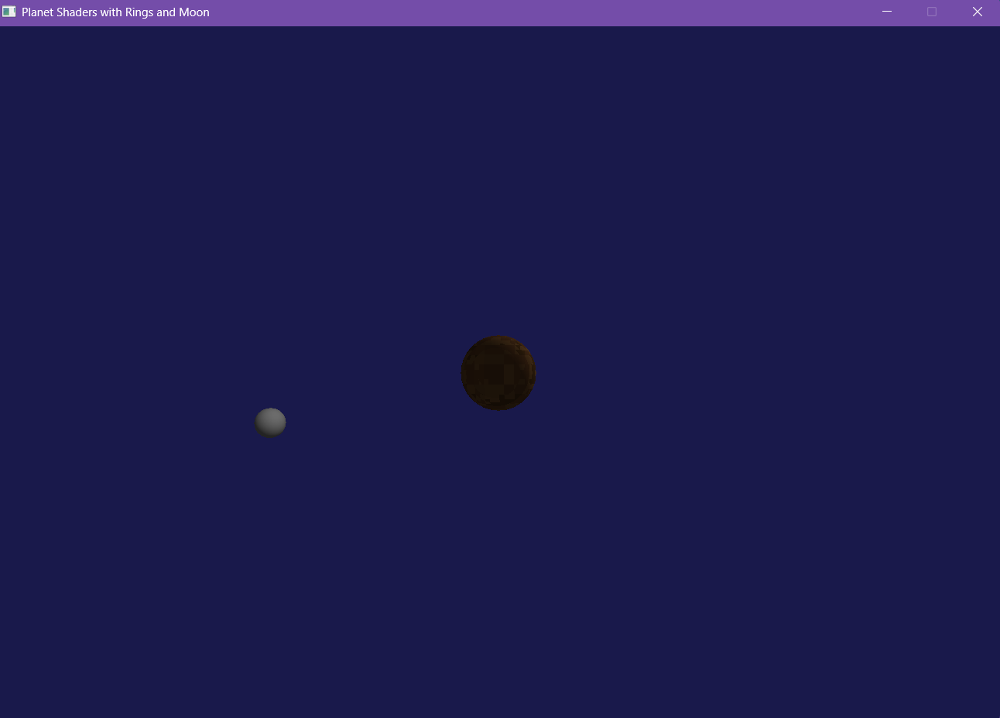
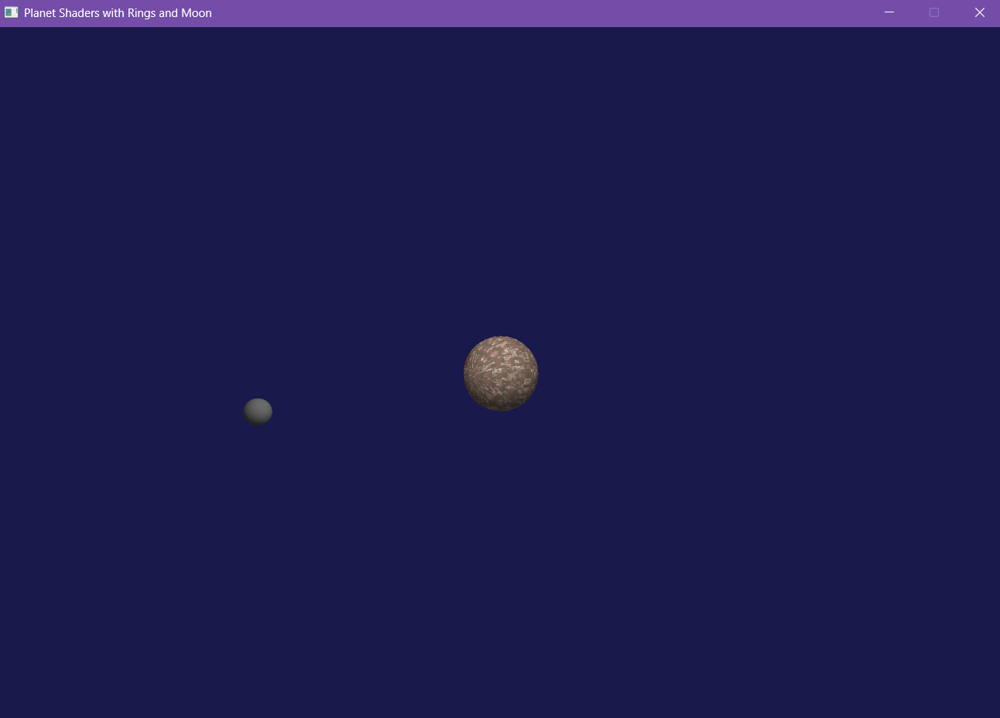
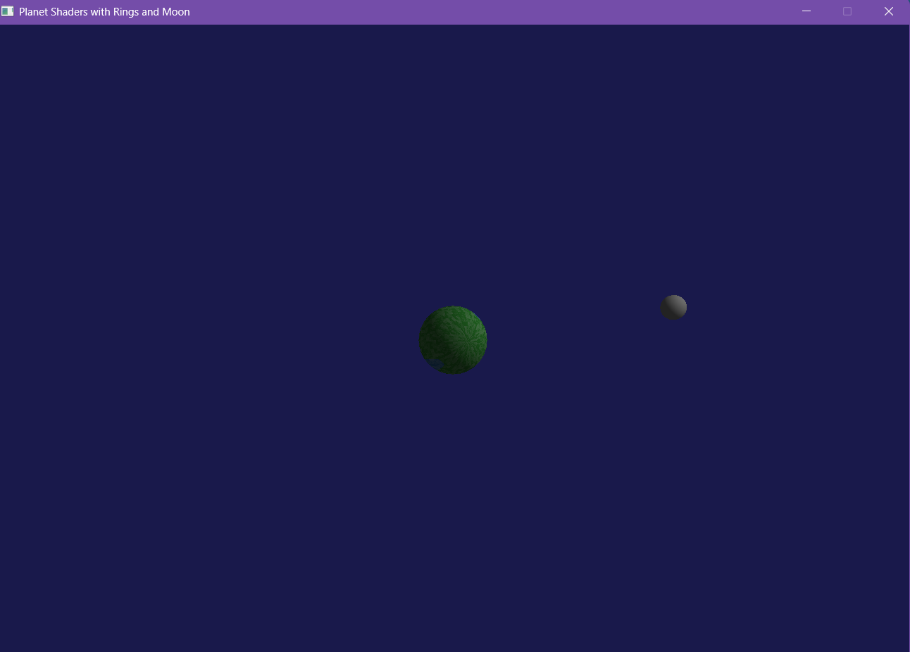
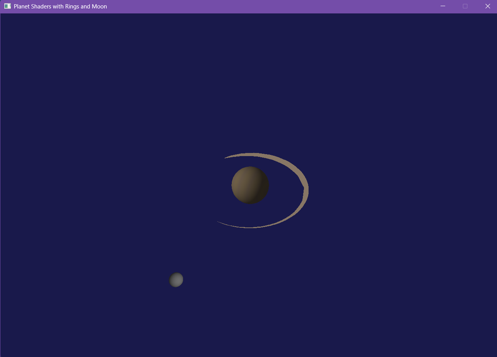
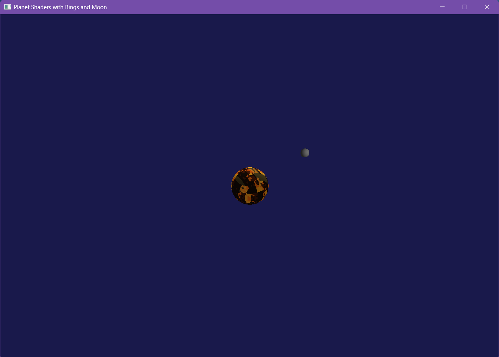

# Planet Shader Renderer (Laboratorio 4)

Un renderizador 3D de planetas con diferentes tipos de superficies, anillos y luna, implementado en Rust con shaders personalizados. (fotos de los planetas estan abajo). Este branch esta dedicado para el laboratorio 4 de graficas.

## Controles de la Cámara

- **Movimiento de Cámara (Orbital):**
  - `W`/`S`: Inclinar hacia arriba/abajo
  - `A`/`D`: Rotar izquierda/derecha
  - `R`/`F`: Mover cámara hacia arriba/abajo
  - `Q`/`E`: Desplazamiento lateral izquierda/derecha
  - `Flechas`: Zoom in/out y rotación horizontal

- **Selección de Planetas:**
  - `1`: Planeta rocoso
  - `2`: Gigante gaseoso
  - `3`: Planeta con agua y tierra
  - `4`: Planeta con anillos (estilo Saturno)
  - `5`: Planeta de lava

## Estructura del Proyecto

### Uniforms

La estructura `Uniforms` contiene las matrices y parámetros necesarios para el renderizado:

```rust
pub struct Uniforms {
    pub model_matrix: Matrix,      // Matriz de modelo (transformaciones del objeto)
    pub view_matrix: Matrix,       // Matriz de vista (posición/orientación de la cámara)
    pub projection_matrix: Matrix, // Matriz de proyección (perspectiva)
    pub viewport_matrix: Matrix,   // Matriz de viewport (espacio de pantalla)
    pub time: f32,                 // Tiempo transcurrido en segundos
    pub dt: f32,                   // Delta time en segundos
    pub planet_type: i32,          // 0: rocoso, 1: gaseoso, 2: personalizado, 3: con anillos, 4: de lava
    pub render_type: i32,          // 0: planeta, 1: anillos, 2: luna
}
```

### Funciones Principales

#### `vertex_shader(vertex: &Vertex, uniforms: &Uniforms) -> Vertex`
Procesa los vértices aplicando transformaciones de modelo, vista, proyección y viewport.

#### `fragment_shader(fragment: &Fragment, uniforms: &Uniforms) -> Vector3`
Genera el color de cada píxel basado en el tipo de planeta y efectos de iluminación.

#### Funciones de Generación de Planetas

1. **`rocky_planet_color(pos: &Vector3, time: f32) -> Vector3`**
   - Genera un planeta rocoso con cráteres y montañas.
   - Usa ruido fractal para la textura de la superficie.
   - Incluye efectos de iluminación dinámica.

2. **`gaseous_planet_color(pos: &Vector3, time: f32) -> Vector3`**
   - Crea un gigante gaseoso con bandas de colores.
   - Incluye efectos de tormentas y nubes dinámicas.

3. **`custom_planet_color(pos: &Vector3, time: f32) -> Vector3`**
   - Genera un planeta con océanos, continentes y nubes.
   - Incluye efectos de iluminación atmosférica.

4. **`ringed_planet_color(pos: &Vector3, time: f32) -> Vector3`**
   - Crea un planeta con anillos (estilo Saturno).
   - Los anillos se renderizan como un plano con textura.

5. **`lava_planet_color(pos: &Vector3, time: f32) -> Vector3`**
   - Genera un planeta volcánico con ríos de lava.
   - Incluye efectos de iluminación y emisión de luz.

#### Funciones de Renderizado Adicionales

- **`render_rings()`**: Renderiza los anillos alrededor del planeta.
- **`render_moon()`**: Renderiza la luna que orbita alrededor del planeta.

## Cómo Ejecutar

1. Asegúrate de tener Rust instalado en tu sistema.
2. Clona el repositorio.
3. Navega al directorio del proyecto.
4. Ejecuta `cargo run`.

## Requisitos

- Rust (última versión estable)
- Cargo (gestor de paquetes de Rust)
- OpenGL 3.3 o superior

## Galería





